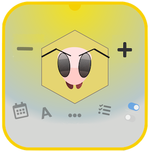

# pcelar
Program za pozicioniranje košnica i vođenje dnevnika stanja košnice

<pre>
     program : Ovaj program je namenjen za vođenje evidencije stanja i planiranja postavke košnica
                    Prvi ekran je početni ekran koji beleži statistiku i navodi nas ka ostalim delovima programa
                    Srednji prsten nas vodi ka map/tabeli, gde vodimo evidenciju košnica,
      mapa   : Mapa je tabela sa ćelijama koje predstavljaja plan mesta gde se nalaze naše košnice (voćnjak, livada...)
                    Košnica je dodeljena žuta ćelija. Klikom na ćeliju tabele, pretvaramo praznu ćeliju u košnicu.
                    Svaka košnica ima mogućnost brisanja(x) i editovanja(e)
                    Košnica ima mogućnost vođenja dnevnika, klikom na edit(e) započinjemo dnevnik po košnici.
                    Dnevnik košnice služi da unesemo zapaženo stanje košnice
                    Košnice koje imaju dnevnik se automatski prepoznaju i imaju znak hexagon na sebi
                    Košnica se briše klikom na crveni(x) iznad košnice,
      pretraga : Sekcija [mapa] ima mogućnost pretrage dnevnika svih košnica,
                 započeto slovo se pronalazi u zbirki unosa i označava košnicu rozom bojom,
      ↰        : Povratak unazad / zadrži dugme 3 sekunde da osvežiš program`,
      ?        : Pomoć, uputstvo programa,
      Z+/Z-    : Zumiranje/odzumiranje mape zarad boljeg pregleda,
      ↺        : Rotiranje mape,
      -r       : Ukloni poslednji red iz tabele, smanji širinu mape,
      +r       : Dodaj jedan poslednji red tabeli, proširi mapu,
      -c       : Ukloni poslednju kolonu iz tabele, smanji mapu,
      +c       : Dodaj jednu kolonu tabeli, proširi mapu,
      dnevnik  : Dnevnik je mesto gde su evidentirane sve košnice i unešeni detalji svake posebno. Dnevnik automatski izračunava poziciju košnice,
      ostalo   : Ovde možemo exportovati naš dnevnik sa mapom i spiskom košnica u nameri da ga sačuvamo kao .csv fajl kao i importovati stari dnevnik,
                      čuvanje podataka: Ovaj program je specijalno napisan da nema potrebe da se registrujete, 
                      svaka aktivnost se odigrava na vašem telefonu/računaru u okviru
                      jednog pretraživača i koristi lokalne resurse da popamti urađene stvari, 
                      program je potpuno bezbedan i privatan za svakog korisnika,
                      jer se sve odigrava na klijentovoj strani
                      Svaki povratak na početni ekran sačuvaće dotadašnji unos,              
      kreirao  :  Petar Sladojević
                  godina(2023)
                  kontakt: <a href="https://www.linkedin.com/in/petar-sladojevi%C4%87-5b7847237/recent-activity/">Linkedin</a>

</pre>
